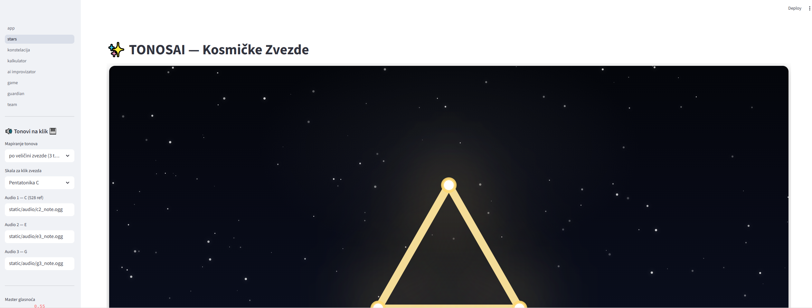
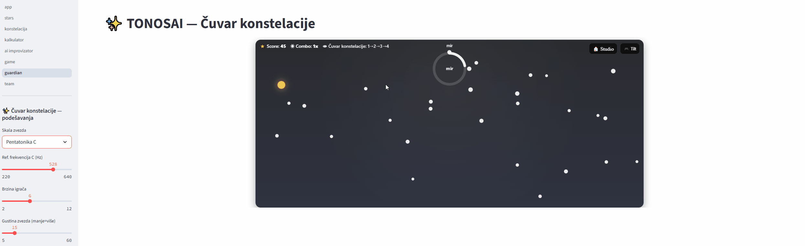

docs: add demo gifs to README
<p align="center">
  <a href="https://python.org"></a>
  <a href="LICENSE.md"></a>
  
</p>

## 📸 Screenshots


## 🎬 Demo

**Collector**  


**Guardian**  



# 🎵 TONOSAI – AI Improvizator

TONOSAI je AI studio fokusiran na kreativne muzičke alate. Ova aplikacija – **AI Improvizator** – omogućava generisanje muzičkih fraza na osnovu korisničkog izbora skale, tempa, instrumenta i broja tonova.

## 🚀 Pokretanje aplikacije

Pokreni aplikaciju lokalno:

```bash
streamlit run app/improvizator.py
